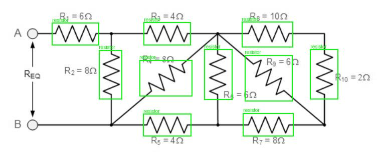
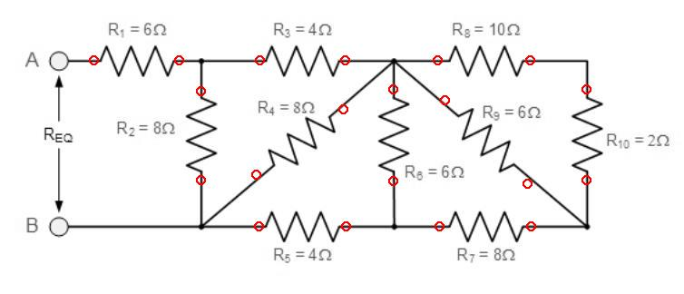
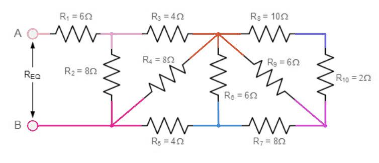
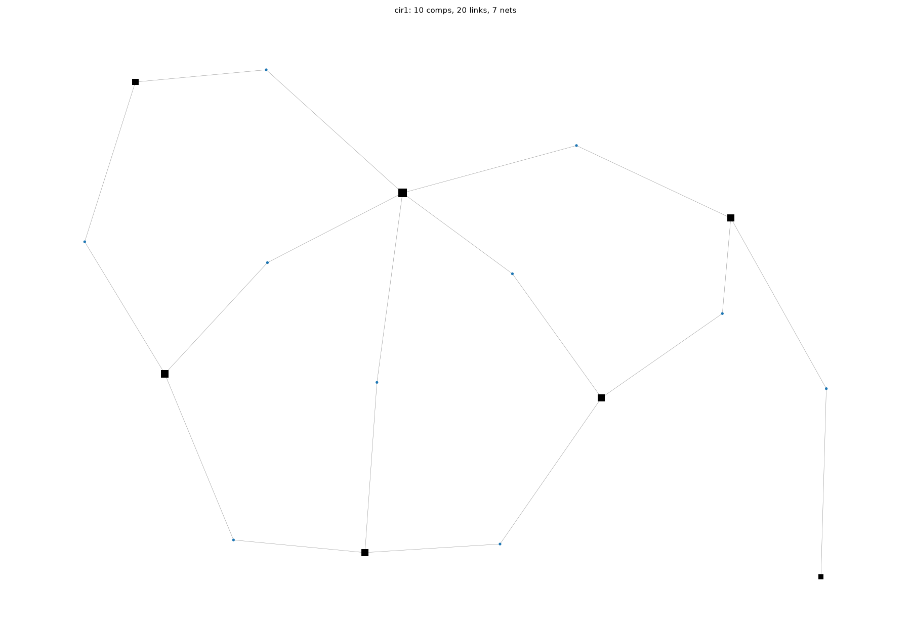
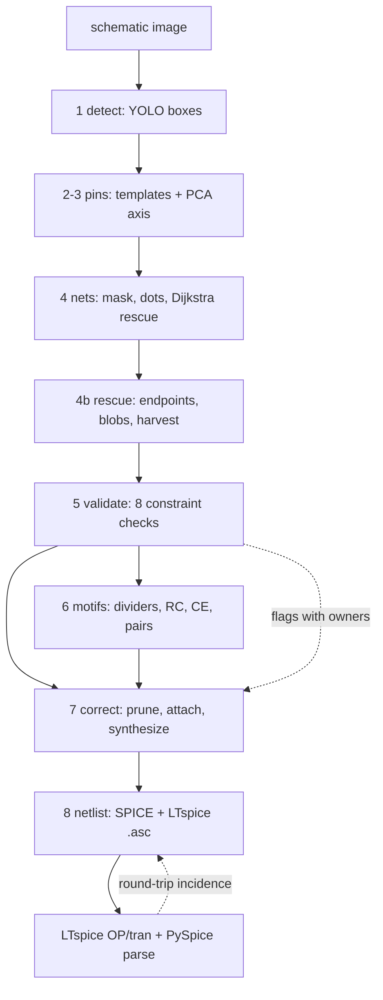
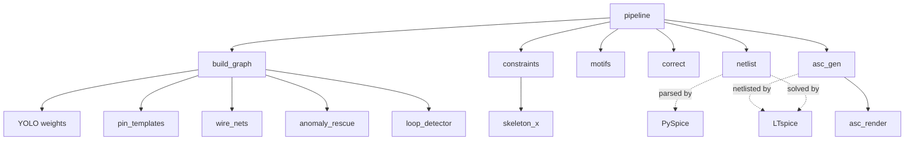

# CircuitVision

  

**Any schematic image → component/pin/net graph → SPICE netlist → LTspice schematic. Every stage proves itself with numbers.**

```bash
pip install ultralytics opencv-python networkx matplotlib scikit-image
python pipeline.py demo/inputs/cir1.jpeg --sim --ltspice
```

That one command runs detection → pin grounding → wire/net extraction → anomaly rescue → constraint validation → semantic motifs → graph correction → netlist → LTspice schematic + simulation. Outputs land in `demo/outputs/<image>/`, verified at every step.

---

## Example 1 — resistor network: Req = 10.000000 Ω

Input [`demo/inputs/cir1.jpeg`](demo/inputs/cir1.jpeg) (equivalent-resistance textbook problem, values printed on the sheet):

| Detection | Pins | Nets | Graph |
|---|---|---|---|
|  |  |  |  |

10/10 resistors found, 0 rescue needed, pins land on leads including diagonals (PCA axis: R9 45.4°, R4 143.0°). Validator: all checks PASS, 0 floating pins.

Reconstruction ([`cir1.asc`](demo/outputs/cir1/cir1.asc)) — symbols at detected boxes, rails snapped straight, verified **20/20** by LTspice's own netlister:


Proof, not vibes: printed values assigned, 1 A injected A→B, LTspice OP reads **Req = 10.000000 Ω** — digit-for-digit with hand nodal analysis.

## Example 2 — SMPS controller (171 components)

[`demo/inputs/smps.jpg`](demo/inputs/smps.jpg) → 113 detected + 58 rescued (endpoint clustering, thick-blob symbols, corroborated low-conf harvest) → 301 pins, 86 nets, 27 raw grounds collapsed to one, full SPICE netlist, LTspice OP solved in 0.07 s. Anomaly rescue alone: 11 → 58 recovered after the wire-linearity upgrade.

## Example 3 — Wien bridge

[`demo/inputs/wien_bridge.jpg`](demo/inputs/wien_bridge.jpg) → 23 comps, 43 pins, 13 nets, both transistors with correct c/b/e roles, bias-divider and dual-diode motifs recognized, netlist + transient deck generated.

---

## How it works



## Architecture



One contract flows through everything (`graph_schema.py`): **component → pin → net**, never component → component, so every correction is possible on pins. Each stage reads it, none bypasses it.

## Project phases

| Phase | Scope | Status |
|---|---|---|
| Milestone 1 | End-to-end netlist on clean sheets | ✅ cir1 Req=10.000000, SMPS OP solved |
| Milestone 2 | Correction lift over uncorrected baseline | ✅ opens 2→0, dangling 5→2, islands 17→7 |
| Milestone 3 | Semantic motifs guiding repair | ✅ 7 matchers + ranked repairs |
| Milestone 4 | OCR values/refdes, macromodels, SKiDL export, benchmark | 🔲 next |

| Stage | Module | What it does |
|---|---|---|
| 1 Detection | `control/` (YOLOv8s-p2, 68 classes, mAP50 0.665) | boxes + classes + conf |
| 2–3 Pins | `pin_templates.py` | orientation-aware templates, edge-wire snapping, PCA axis for diagonals, IC stub finder |
| 4 Nets | `wire_nets.py` | Otsu binarization, masked interiors, dot union-find, Dijkstra gap rescue with sibling exclusion |
| 4b Rescue | `anomaly_rescue.py`, `loop_detector.py` | dead-end endpoints, thick blobs, low-conf harvest, loop/IC-footprint proposals |
| 5 Validate | `constraints.py` (8 checks) | 2-terminal, windings, roles, sources, ground collapse, crossings (skeleton X), crossovers, shorts/islands |
| 6 Motifs | `motifs.py` | dividers, decoupling, RC, common-emitter/follower, parallel pairs + repair ranking |
| 7 Correct | `correct.py` | noise prune, ground homing, motif attach, IC synthesis — all logged, below-threshold stays flagged |
| 8 Netlist | `netlist.py`, `asc_gen.py` | SPICE + LTspice `.asc` (verified round-trip), PySpice parse, LTspice batch sim |

Contract for everything: component → pin → net, never component → component (`graph_schema.py`).

## Verification philosophy

Nothing is claimed without a check: detectors measured (mAP, pin-on-wire 100%), every validator finding carries an owner, corrections re-validate before/after, and two external tools audit the output — **PySpice** parses every netlist with a real grammar, **LTspice** solves every deck and re-netlists every `.asc` (incidence must match 100%).

## Repo layout

- `pipeline.py` — the one entry point (any image in, everything out)
- `build_graph.py` — shared detect→graph used by all stage scripts
- `demo/inputs/` — input schematics; `demo/outputs/<name>/` — all artifacts per image
- `control/` — Kaggle training control plane; `datasets/` — YOLO datasets + roadmap
- `PROGRESS.md` — full execution log (decisions, bugs caught, known limits)

## Large files & upload notes

- Weights (`control/runs/*/best.pt`, ~22 MB each) — consider Git LFS before pushing.
- `*.raw` / `*.log` / `*.net` are regenerable solver artifacts (git-ignored).

## Roadmap

Milestone 1 ✅ (this repo): end-to-end topology + correction lift, proven on 3 sheets.
Next: OCR values/refdes (Milestone 4), KA7500-class macromodels, SKiDL export (needs KiCad libs), batch benchmark vs Schemato/Weave-style converters.

## License

MIT — see LICENSE (add before publishing).
