# CircuitVision Tutorial — From Image to Simulation

> Goal: understand every part well enough to explain it in an interview.
> How to use this doc: look at each picture first, read second. Code comes last in every section.

---

## Table of Contents

1. [Lesson 1 — What CircuitVision Is](#lesson-1--what-circuitvision-is)
2. [Lesson 2 — Training the detector (`control/` + `datasets/`)](#lesson-2--training-the-detector-control--datasets)
3. [Lesson 3 — The Graph Contract (`graph_schema.py`)](#lesson-3--the-graph-contract-graph_schemapy)
4. [Lesson 4 — Pin Templates (`pin_templates.py`)](#lesson-4--pin-templates-pin_templatespy)
5. [Lesson 5 — Wires and Nets (`wire_nets.py`)](#lesson-5--wires-and-nets-wire_netspy)
6. [Lesson 6 — Rescue (`anomaly_rescue.py`)](#lesson-6--rescue-anomaly_rescuepy)
7. [Lesson 7 — Loops and Skeletons (`loop_detector.py` + `skeleton_x.py`)](#lesson-7--loops-and-skeletons-loop_detectorpy--skeleton_xpy)
8. [Lesson 8 — Validator (`constraints.py`)](#lesson-8--validator-constraintspy)
9. [Lesson 9 — Motifs (`motifs.py`)](#lesson-9--motifs-motifspy)
10. [Lesson 10 — Correction (`correct.py`)](#lesson-10--correction-correctpy)
11. [Lesson 11 — Netlist and Simulation (`netlist.py` + `asc_gen.py`)](#lesson-11--netlist-and-simulation-netlistpy--asc_genpy)

**Jargon buster (the only hard words in this doc):**
- *box* = rectangle around one part. *pin* = exact dot where wire touches box. *net* = all copper at the same voltage (one color in the pictures).
- *conf* = how sure the detector is, 0 to 1. *IoU* = how much two boxes overlap, 0 to 1.
- *Otsu* = auto brightness cutoff per photo. *GND* = ground, the shared zero-voltage net.

---

## Lesson 1 — What CircuitVision Is

### One sentence for interview

> Photo of a schematic in, simulated schematic out — with a number proving every step.

Run it with (`pipeline.py:28`):

```bash
python pipeline.py demo/inputs/cir1.jpeg --sim --ltspice
```

### The pipeline

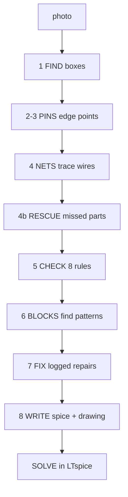
```mermaid
flowchart TD
    IMG[photo] --> DET[1 FIND boxes]
    DET --> PIN[2-3 PINS edge points]
    PIN --> NET[4 NETS trace wires]
    NET --> RSC[4b RESCUE missed parts]
    RSC --> VAL[5 CHECK 8 rules]
    VAL --> MOT[6 BLOCKS find patterns]
    MOT --> COR[7 FIX logged repairs]
    COR --> NL[8 WRITE spice + drawing]
    NL --> SIM[SOLVE in LTspice]
```

Picture — the only 3 jobs that matter:

```
 1. BOXES          2. PINS           3. NETS
 ┌───────┐         wire              paint fill
 │ RRRR  │          |                 ███
 └───────┘        +-*-+             +-███-+
 where is         |RRR| edge        |RRR| same
 the part?        touch point?      color = same voltage?
```

### Proof it works — memorize these 3 numbers

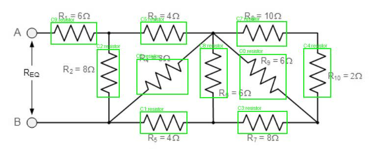

| Sheet | Result |
|-------|--------|
| `cir1` | 10/10 resistors, 20/20 pins wired, answer = **10.000000 Ω** = hand calc |
| `SMPS` | 113 found + 58 rescued = 171 parts, solved in 0.07 s |
| `Wien` | 23 parts, both transistors wired correctly |

---

## Lesson 2 — Training the detector (`control/` + `datasets/`)

> One-line job: teach the detector to find 68 part types by showing it thousands of labeled boxes — then freeze the names so every later lesson can trust them. This runs *before* everything else: Lesson 3's boxes come from these weights.

### 2.1 The training photos

Six photo collections merged into one (`merge_all_yolo_detection.py`): hand-drawn circuits, synthetic CAD, device photos and more — 116,595 photos, 106 name labels to start.

Cleaning jobs (each a small script in `datasets/`):
- Some labels had a 6th column (rotation word like R0/R90) that breaks the detector format → stripped to 5 columns, rotation saved sideways (`fix_blocker1_orientation.py`).
- Same hand-drawn circuit appeared in train *and* test (leak: memorizing, not learning) → re-split by circuit name so each circuit lives in one split only (`fix_blocker2_cghd_resplit.py`).
- Phone photos arrived rotated/gray/messy → straightened, made RGB, bad boxes dropped (`colab_stage1_label_cleaner.py`).

### 2.2 From 106 names to 68 (why each cut)

| Step | What | Plain reason |
|------|------|--------------|
| 106 → 92 | Fold lookalikes (`nmos.cross→nmos`, `transistor→transistor.bjt`), fold 9 ultra-rare names into `unknown` (`apply_taxonomy_remap.py`) | Don't teach 4 names for one shape; don't teach names with ~10 examples |
| 92 → 71 | Drop classes with <100 examples or <25 photos (`freeze_taxonomy.py`, `control/runs/taxonomy_v1/`) | A class with 12 photos can't be learned |
| 71 → 69 | Drop 2 zero-photo leftovers (`taxonomy_v2`) | Literally nothing to show |
| 69 → 68 | Drop `unknown` itself (`freeze_v3.py`) | "Unknown" was pure noise the model couldn't learn |

Published once as a versioned photo pack (`circuitvision-focused69`, 16,595 photos, gray-boosted) — every later training run just attaches it, zero rebuilds. The 100k-image synthetic bulk was left out on purpose: wrong style for this job.

### 2.3 How training ran (cloud GPUs, crash-proof)

- **Control plane** (`control/kaggle_ctl.py`): push code, watch status, download weights — no browser clicking. Token lives in environment only, never in files.
- **Crash-proof segments** (`control/chain_train.py`): cloud machines die mid-run and wipe scratch space. So train in short chained runs: every finished run saves outputs, the next run resumes from its `last.pt`. Worst loss = one segment.
- **Self-contained jobs** (`control/jobs/train_stage1/`): the cloud uploader only takes one file, so the name table + training script are packed *inside* the driver before push (`build_job.py`). Photos are linked, labels rewritten to the 68 names on the fly.
- **Settings, plainly:** 40–60 rounds over the photos, 640 px pictures first, then a 1024 px sharp-eyes pass with the first 10 layers frozen (keep edge-finding, retrain the rest) at tiny learning rate; **no mirror flips** — mirroring turns npn into pnp, and direction *is* the class; brightness jitter only (gray photos have no color to jitter); copy-paste boost 0.3 for rare parts.
- **GPU trivia that cost a day:** the default cloud card + new PyTorch didn't work together → pinned two T4 cards; kernels prove CUDA with one tiny math op before burning hours.

### 2.4 Results — read the curves (30 seconds per photo)

**Photo 1 — present it like this:** "Top row is mistakes on training photos — falling is good. Bottom row is held-out checks. I point at the two green-boxed score panels first: the orange trend goes flat at 0.665 / 0.485 over the last 8 rounds. Flat = converged, more rounds won't help — that's why the project wins in legs/wires/checks instead."

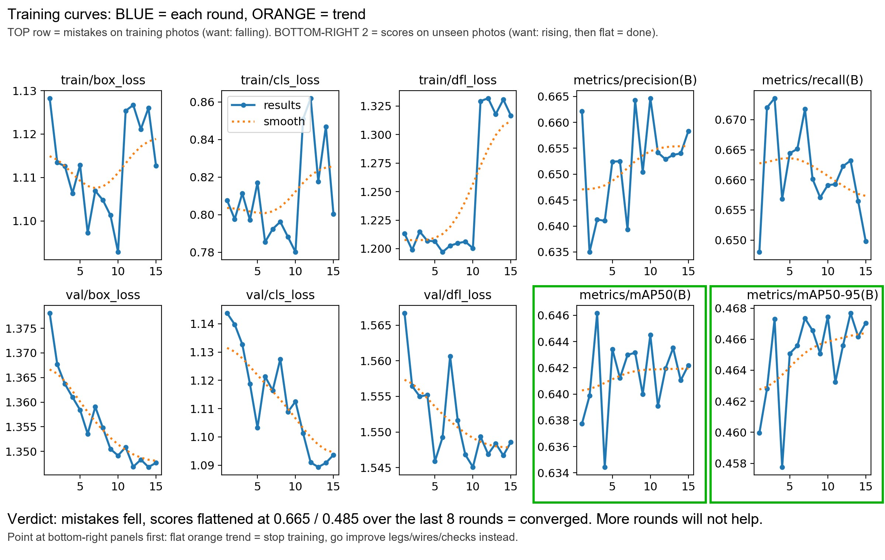

- Top row = training mistakes (box position, name, fine position): falling = learning.
- Bottom row = held-out checks: box mistakes falling, **scores flattening at the right edge = converged**.
- Final (`control/runs/round3_68_v1/METRICS.md`, 56 rounds, early-stopped): accuracy-50 = **0.665**, strict accuracy = **0.485**, correct-guess rate 0.69, found-rate 0.69. Plainly: two-thirds of boxes overlap truth by half or more. Last 8 rounds flat (0.664–0.669) — the +0.1 target was *not* reached by tuning alone.
- Weights: `control/runs/round3_68_v1/best.pt` (~22 MB, the one everything loads). High-res pass: `control/runs/stage2_v1/best_stage2.pt`.

**Photo 2 — present it like this:** "Rows are truth, columns are guesses. Pick any row — say resistor — slide right: the brightest square is the resistor column. Bright diagonal = learned. The faint smudges sit only on lookalikes — transistor flavors, capacitor flavors — which is exactly what my overlap-cleanup step (Lesson 3.4) fixes."

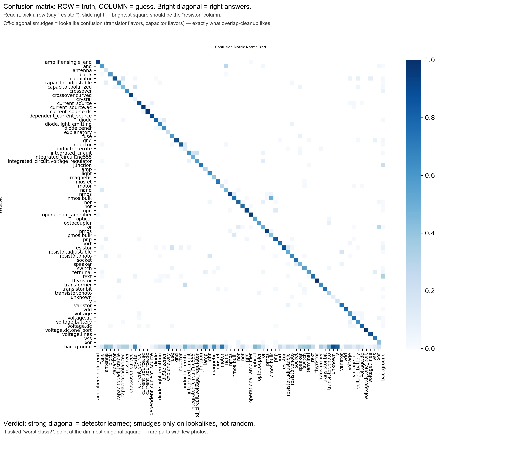

- If asked "worst class?": point at the dimmest diagonal square — rare parts with few photos (that's why the vocabulary freeze dropped them).
- If asked "why is the bottom row smeared?": that's the `background` row — things the model fired on with no labeled box there. Expected on dense sheets; the validator prunes them.
- Honest negative result on record: a 100-round backbone trains no better than plain pretrained weights past ~15 rounds on this task — so the project wins in later lessons (legs, wires, checks, fixes), not by squeezing the detector.

> Interview line: "116k photos merged and cleaned, vocabulary frozen 106 to 68 by dropping what can't be learned, crash-proof GPU segments with resume, 640 then sharp-eyes 1024 with frozen early layers and no flips — 0.665 and flat, so the graph stages carry the win, not more tuning."

---

## Lesson 3 — The Graph Contract (`graph_schema.py`)

### 3.1 Part / Pin / Net

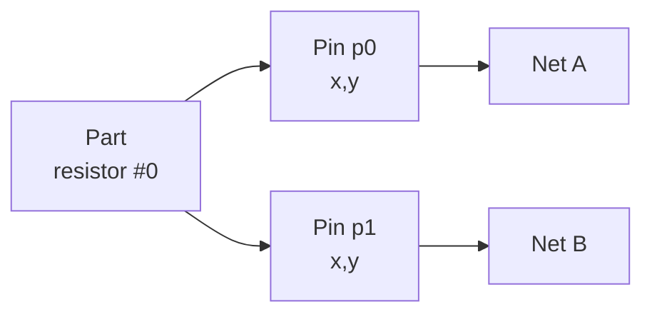
```mermaid
graph LR
    C[Part<br/>resistor #0] --> P0[Pin p0<br/>x,y]
    C --> P1[Pin p1<br/>x,y]
    P0 --> N0[Net A]
    P1 --> N1[Net B]
```

> Rule: part → pin → net ONLY. Never part → part.

Why? A broken wire needs an address:

```
 GOOD:  R1 -> pin0 -> NetA      R1 -> pin1 -> None (floating, fixable!)
 BAD:   R1 -> R2                (which leg is broken? can't say)
```

With pins, a fix = move one pointer from `None` to a net. Without pins, you must rewrite everything.

What lives inside (`graph_schema.py:9-40`):

```python
Component(id=0, cls="resistor", conf=0.91, bbox=(100,200,150,220), orientation=0)
Pin(id=0, comp_id=0, role="p0", x=100, y=210)
Net(id=0, pin_ids=[0, 5, 9])
```

- `bbox` = box corners `(left, top, right, bottom)` in pixels.
- `role` = which leg: `p0/p1` for a resistor, `c/b/e` for a transistor, `g` for ground.
- `orientation` = turned how far: 0, 90, 180, or 270. 0 = as drawn.
- `conf` = detector sureness, 0 to 1.

(`@dataclass` just saves typing — it auto-builds these containers.)

Safety check (`validate`, `graph_schema.py:42-47`): every pin must belong to a real part, every link to a real pin. If not, crash now — never build a broken graph quietly.

### 3.2 What is `dets`?

`dets` = detections = plain list from the detector. One entry per guess:

```python
("resistor", 0.91, (100, 200, 150, 220))
#  what      sure   box
```

The detector fires overlapping guesses on one part. Next step cleans that.

Note: the `0.5` in `dedup_components(dets, 0.5)` is **overlap limit**, not sureness. Suresness filtering (`conf=0.35`) happens earlier in `build_graph.py:35`. Two different knobs.

### 3.3 IoU — how much do two boxes overlap?

`box_iou` (`graph_schema.py:54-63`). Overlap area ÷ total area. 0 = apart, 1 = identical.

Worked example:

```
 A: (0,0)-(10,10)   area = 100
 B: (5,5)-(15,15)   area = 100
 overlap: (5,5)-(10,10) = 5 x 5 = 25
 total = 100 + 100 - 25 = 175   (don't count overlap twice)
 IoU = 25 / 175 = 0.14 → different parts, KEEP both
```

Same part twice:

```
 A: (0,0)-(10,10),  B: (1,1)-(11,11) — shifted 1 px
 overlap ≈ 81, total ≈ 119, IoU ≈ 0.68 → same part, DROP one
```

Code shape: left/top of overlap = bigger of the two lefts/tops; right/bottom = smaller of the two; multiply; divide.

### 3.4 `dedup_components` — keep the surest box

```python
# graph_schema.py:66-79 — highest sureness first
for cls, conf, bbox in sorted(dets, key=lambda d: -d[1]):
    if any(box_iou(bbox, b) > 0.5 for _, _, b in out):
        continue   # overlaps something kept → drop
    out.append((cls, conf, bbox))
```

Picture — detector double-fired on one transistor:

```
 BEFORE (IoU=0.68):   SORT: [npn 0.91, pnp 0.62]
 ┌─────────┐          keep npn 0.91
 │┌─────────┐         pnp 0.62 overlaps → dropped
 ││ npn 0.91│
 ││ pnp 0.62│         AFTER: 1 box (npn 0.91)
 │└─────────┘
 └─────────┘
```

Why sort first? Otherwise you might keep the 0.62 guess and drop the 0.91 one — wrong survivor. (Real case: only 2 true npn/pnp stacks; the rest of the clutter was drawn labels, not boxes.)

---

## Lesson 4 — Pin Templates (`pin_templates.py`)

> Whole file = Step 2 only: where does wire touch box?

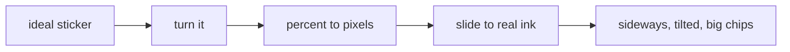
```mermaid
flowchart LR
    RAW[ideal sticker] --> ROT[turn it]
    ROT --> AT[percent to pixels]
    AT --> SNAP[slide to real ink]
    SNAP --> SPEC[sideways, tilted, big chips]
```

### 4.1 Families — same wiring, different look

Parts that look different but wire the same share one template:

```python
AXIAL2  = {"resistor","capacitor","inductor","diode","fuse",...}  # 2 legs, one line
GROUND1 = {"gnd","vss"}        # 1 leg on top
RAIL1   = {"vdd"}              # 1 leg at bottom
PORT1   = {"port","terminal",...}  # 1 leg center
BJT3    = {"npn","pnp","transistor.bjt",...}  # legs c,b,e
FET3    = {"mosfet","nmos","pmos",...}        # legs d,g,s
GATES   = {"and","or","not",...}
ICS     = {"integrated_circuit",...}
XFORMER = {"transformer","relay",...}
NONE    = {"text","crossover","junction",...}  # 0 legs, not electrical
```

```
 2-leg part           ground             transistor
 ┌──────────┐         wire               c ●── top-right
 │          │          |              ┌──────────────┐
 *   RRRR   *        | GND |          │              ● b left
 │          │        +-----+          │              │ 
 └──────────┘                         │              ● e bottom-right
 * = leg                              └──────────────┘
```

`if cls in AXIAL2:` just means "is this a 2-leg inline part?" — no 20-name lists everywhere.

### 4.2 `_at` — percent → pixels ("sticker to wall")

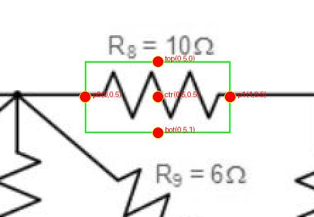

```python
# pin_templates.py:64-67
# x = left + across*(right-left),  y = top + down*(bottom-top)
```

`across` 0.0 = left edge, 1.0 = right edge. `down` 0.0 = top, 1.0 = bottom. Same percents fit tiny and huge boxes.

Box `(0,0,100,20)`:

```
 (0.0,0.5) → (0, 10)    left-middle
 (1.0,0.5) → (100, 10)  right-middle
 (0.5,0.0) → (50, 0)    top-middle
 (0.5,1.0) → (50, 20)   bottom-middle
```

### 4.3 `_rot` — turn the sticker

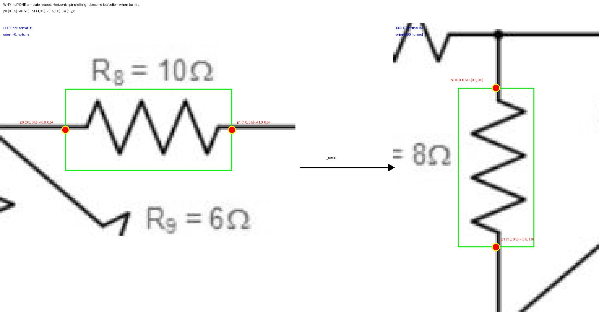

**Point in one line:** write the resistor template ONCE as flat, reuse it for tall parts by turning it.

- Left (real flat R8, no turn): `p0 (0.0,0.5)` stays left edge, `p1 (1.0,0.5)` stays right edge.
- Right (real tall R2, turned 90° by `(1-down, across)`): `p0` → `(0.5,0.0)` top edge, `p1` → `(0.5,1.0)` bottom edge.

Without this, tall R2 gets flat legs stuck in white paper. Old bug, 40 parts sideways until turning + wire vote fixed it.

Turn table (`pin_templates.py:50-61`): 0 = as-is, 90 = turned, 180 = upside down, 270 = other way.

### 4.4 `_raw_pins` — the ideal sticker sheet (no photo yet)

```python
def emit(role, pt, conf=0.9):
    out.append((role, _rot(pt, orientation), conf))
```

| Part | Ideal legs |
|------|-----------|
| resistor etc. | `p0` left-middle, `p1` right-middle |
| ground | `g` top-middle (wire comes from above) |
| transistor | `c` top-near-right, `b` left-middle, `e` bottom-near-right |
| logic gate | inputs left, output right |
| big chip | many down both sides, low trust (0.5, it's a guess) |
| text | none — not electrical |

Why `0.85` across for transistor top/bottom, not `0.5`? Its inner bar sits right of center, so leads hit near the right: `(0.85,0.0)` → x=85 on a 0–100 box. Base stays left-middle.

### 4.5 `detect_edge_wires` — peek outside for real ink

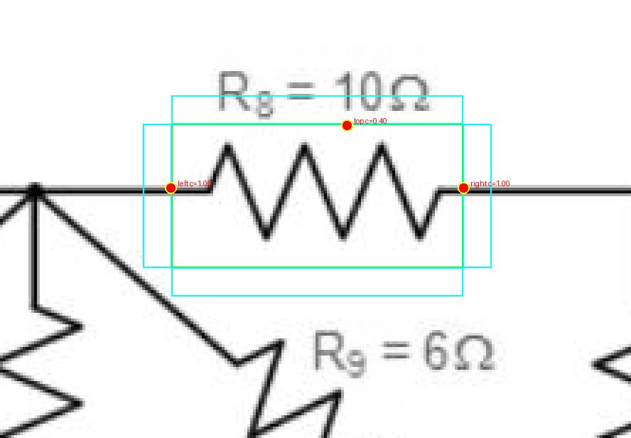

Stop trusting the sticker. Look in 4 thin strips just outside the box (10 px wide) and count black per row/column. Peak = wire:

- **left:** strip left of box → peak row = wire height → `(left, wire_y, strength)`.
- **right / top / bottom:** same idea, 4 sides.
- Strength 1.0 = solid wire, ~0.3 = gray text smudge, missing = white paper.

Example return: left hits at y=212 strong, right at y=215 strong.

### 4.6 `pins_for` — slide sticker to real wire

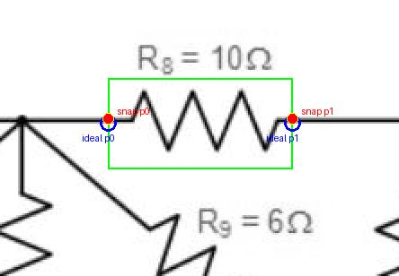

Keep the edge, slide along it to the real wire height (or width):

- Flat part: x stays at left/right edge, y slides to the wire found there (else box middle).
- Tall part: same, swapped.
- Ground: x slides to top wire. Transistor: same per leg.
- No wire found → keep ideal.

This slide took legs-on-wire 86% → 100%.

### 4.7 `score_orientation` — flat or tall?

**Job:** flat (`0`, legs left/right) or tall (`90`, legs top/bottom)? Measure the 4 peeks from 3.5.

**Example 1 — flat wins (real R8):**

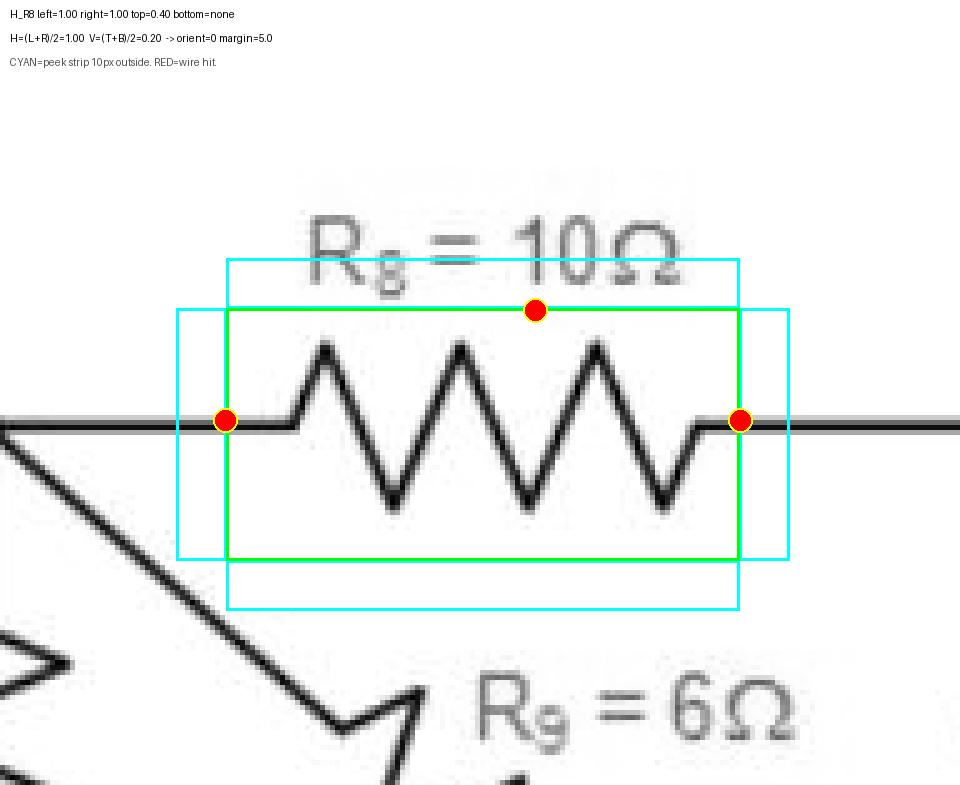

- Flat score = (1.00+1.00)/2 = 1.00. Tall score = (0.40+0)/2 = 0.20. Flat wins by miles → `0`, winning margin 5.0.

**Example 2 — tall wins (real R2):**

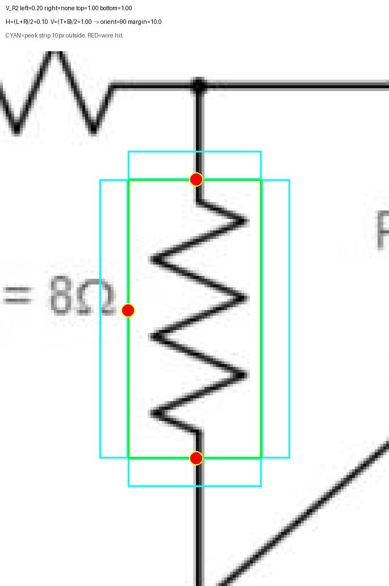

- Tall = 1.00, flat = 0.10 → `90`, margin 10.0.

**Rules** (`pin_templates.py:336-344`): winner must lead by 0.15+ *and* reach 0.2+ (a real wire, not paper noise). Tie → guess by shape (wide = flat, tall = tall, "not sure"). The pipeline only trusts clear wins, else keeps the shape guess — that's why zero random flips. Ground always stays flat-style (wire from above); transistors default base-left unless both side wires show.

### 4.8 `pca_axis` — tilted parts

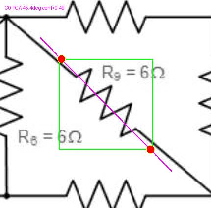

Flat/tall voting fails on a 45° resistor — its leads enter at corners, not edge middles. Fix: look *inside* the box at the ink blob and ask "which way is it stretched?" (that's PCA — longest spread direction). Stretchy enough (long ≥ 2.5× wide) and tilted (>20° off axis) → draw the line through the center, take the 2 border hits as legs. R9 reads 45.4°, R4 143°; straight parts never trigger this.

### 4.9 `ic_stub_pins` — big chips have no sticker

Walk the box border; every clump of black entering = one leg:

```
        top clumps
     ●──┼────┼──●
     │ ┌────┐ │
 left● │ IC │ ●right
     │ └────┘ │
     ●──┼────┼──●
       bottom clumps
```

Needs 2+ clumps or it gives up (caller falls back to even-spacing guess). Text strokes are rejected by checking wire on *both* sides of the border.

---

## Lesson 5 — Wires and Nets (`wire_nets.py`)

> Job: turn black ink into nets. Steps: photo → black-white → hide parts → find dots → flood paint → merge at dots → seat every leg.

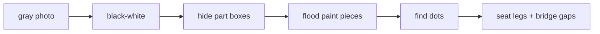
```mermaid
flowchart LR
    G[gray photo] --> B[black-white]
    B --> M[hide part boxes]
    M --> F[flood paint pieces]
    F --> D[find dots]
    D --> P[seat legs + bridge gaps]
```

Real cir1 numbers: cutoff 173, 42 paint pieces → 39 nets → **7** live ones, 20/20 legs seated, 0 floating.

### 5.1 `binarize` — photo to black-white, auto cutoff

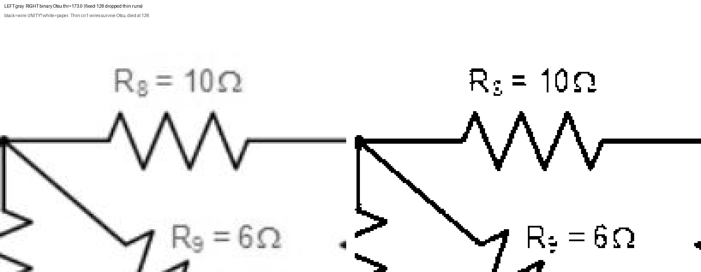

Pixel darker than cutoff = wire (1), else paper (0). Cutoff auto-picked per photo (Otsu — the gray value that best splits dark ink from light paper): smps 138, wien 156, cir1 173. One fixed number (128) erased whole thin runs on cir1 and broke 2 connections.

### 5.2 `mask_interiors` — cover parts so they can't join wires

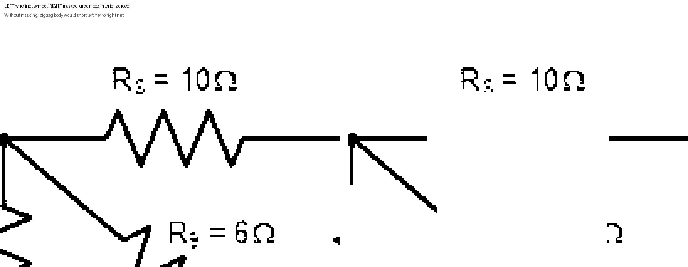

Paint a filled rectangle over every box (+3 px for blurry edges). Without this, the resistor's own zigzag joins its left wire to its right wire — fake short. Now left and right are separate paint pieces, joined later only at real dots.

### 5.3 `find_dots` — the black blobs that mean "these wires join"

> Short version: the detector over-fires on text zeros and misses dots welded to wires. Harmless by design — details below.

**What goes wrong, on real SMPS rail:**

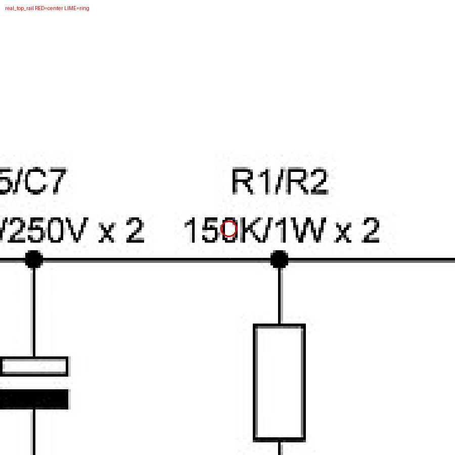

- The two fat black dots ON the wire = true junctions. No red = missed.
- Red on the `0` of `150K` = false alarm on text.

How it hunts (`wire_nets.py:42-81`): small blob? round? do wires leave it (2+ black hits on a ring around it)? A lone `0` passes all three (small, round, its own strokes fake the ring). A real rail dot fails the roundness test — it's welded to wire stubs, one big blobby outline. There are no dot labels anywhere; this check is unsupervised and tuned loose on purpose.

**Why nothing breaks:**

1. A false alarm joins one paint piece with itself = nothing happens.
2. Text scraps are too small to become nets (dropped under 15 px).
3. T-junctions (3 roads or fewer) count as joined with or without a dot glyph. Only bare 4-road crossings strictly need a dot. Proof: cir1 has 0 real dots found, yet 20/20 legs and 7 clean nets (next picture).

Full sheet at real scale — red looks noisy because most of the 99 rings are text loops:

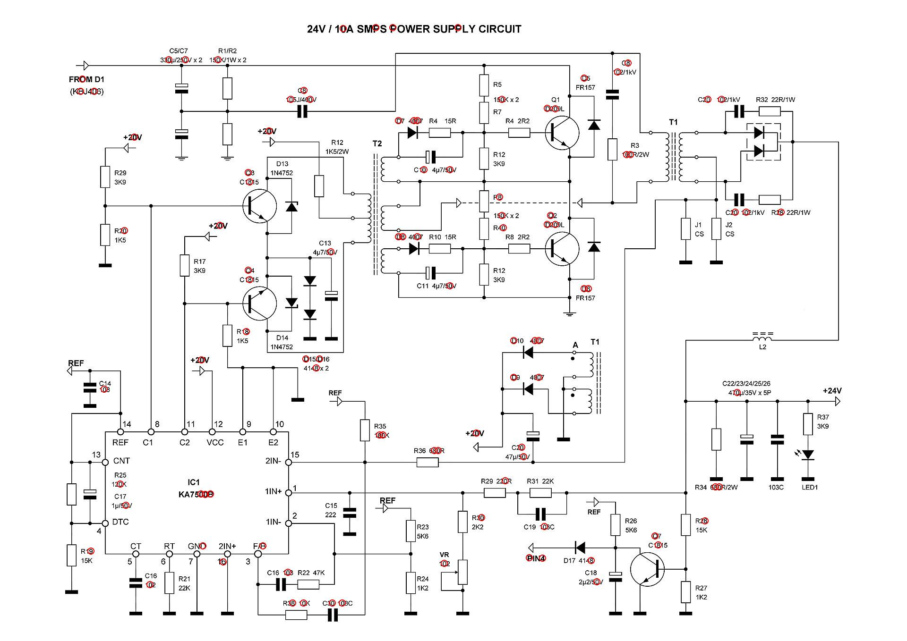

> Interview line: "It over-fires on zeros and misses welded rail dots — loose on purpose, because single-piece joins do nothing, text dies by size, and T's need no glyphs. I proved a recall fix finds the rail dots but chains dense sheets 7→3 nets, so I reverted it."

### 5.4 Flood + merge + seat legs = nets


**Step 1 — flood.** Touching black pixels = one piece. 42 pieces; dust under 15 px tossed.

**Step 2 — merge at dots.** Pieces touching the same red dot within 10 px join. No dot nearby = stay separate — that's how crossings *without* a dot correctly stay split. cir1: 42 pieces → 39 nets → only **7** hold legs (the 7 colors).

**Step 3 — every leg grabs paint.** Look in a 12 px window around each leg, take nearest copper. cir1: 20/20 seated, 0 floating.

**Gap rescue (the maze).** Covering boxes cuts tiny breaks, so some legs float next to copper. Each floater looks around (about a thumb's width) for the nearest wire and walks to it — walking on black wire is cheap, jumping white paper is costly, so only small gaps get bridged. One safety rule: never grab the wire your *own* part's other leg already holds, or you'd short the part. cir1 needed 0 rescues; messy SMPS needed ~50.

> Interview line: "Paint the wires, join paint at dots, seat every leg, bridge small gaps. cir1: 42 scraps to 7 live nets, all 20 legs seated."

---

## Lesson 6 — Rescue (`anomaly_rescue.py`)

> One-line job: the detector missed parts — find them from wire weirdness, then look again where it matters. Wires are thin straight lines; anything else on the wire map is a missed part until proven otherwise.

Real SMPS numbers: 113 boxes → 431 wire-ends, 119 unexplained → 13 end-boxes + 8 fat-blob boxes = 21 zoom targets → +58 rescued → 171 parts.

### 6.1 Dead ends = missed inline parts

A wire pixel with exactly 1 black neighbor is a dead end. A missed resistor leaves exactly 2 dead ends facing each other — so the limit is 2, not 3.

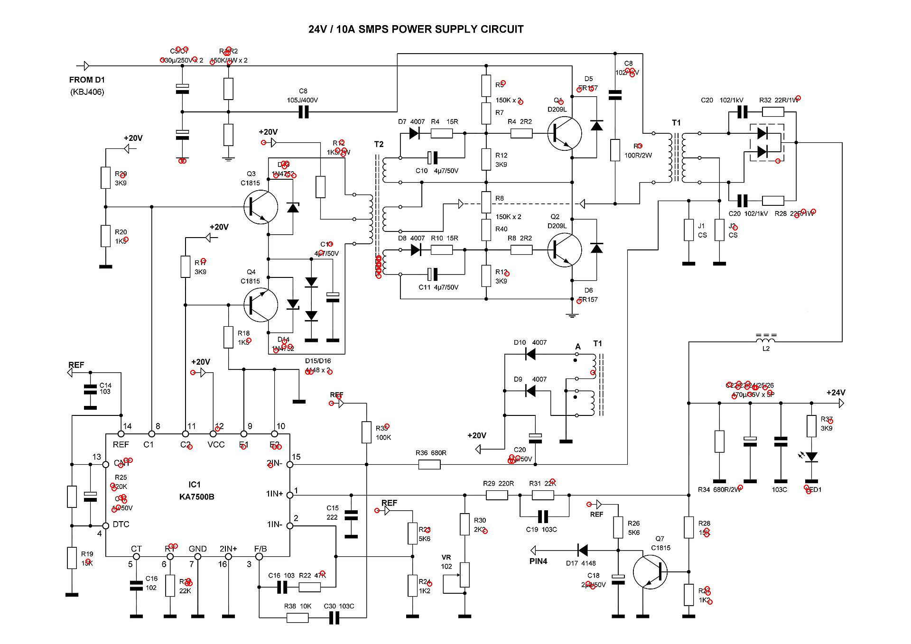

- Red = ends 20+ px from any box and 14+ px from any dot. Most red sits on text (letter strokes end everywhere) — accepted noise. The useful ones sit in empty copper with no box nearby.
- Nearby red dots are grouped (80 px tiles, joined). A group with 2+ ends becomes an orange zoom box (+50 px border). Tiny groups and sheet-sized boxes dropped.

### 6.2 Fat blobs = missed filled parts

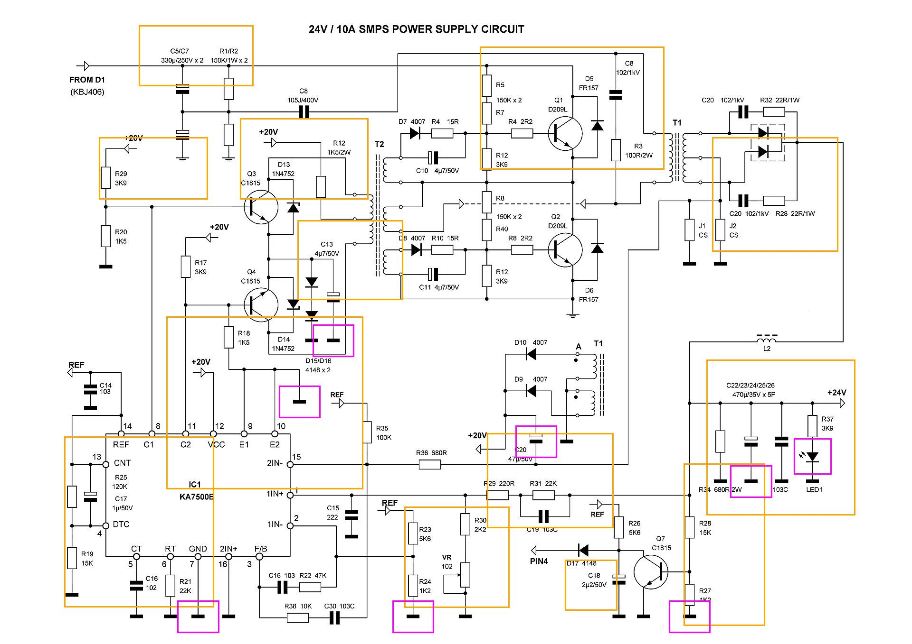

- A 5×5 eraser wipes all thin (1–3 px) wires. Survivors: dots + filled symbols. Subtract dots and boxes → leftovers are missed filled parts. Measured: 8 of 9 leftovers were ground bars.
- Magenta boxes sit on ground bars and the LED block — exactly the filled symbols missed. Hollow shapes (diode triangles, coils) slip past; the harvest below catches them.

### 6.3 Zoom + harvest

- **Zoom:** re-run the detector cropped on each orange/magenta box at low confidence, with 30 px extra border (tight crops cut symbol edges). Keep only new boxes (overlap < 0.5 with known). SMPS: 39 back.
- **Harvest:** full-photo run at very low confidence, keep a new box **only** if it sits on weirdness — near an unexplained end, on a fat blob, or on dense wire. This gate stops hallucinations. SMPS: +19 (lower-right diodes, grounds).
- Total rescued 58 (grounds 18, capacitors 9, ports 9, diodes 6, resistors 5…). Known junk carried forward on purpose: 1 fake antenna, tiny port boxes on dots, ground doubles — Stages 5–7 prune them, cheaper than missing real parts.

> Interview line: "Wires are straight lines, so dead ends and fat blobs are missed parts. Group the ends, erase the wires, zoom the crops and harvest low-confidence boxes only on weirdness: 113 to 171 parts."

---

## Lesson 7 — Loops and Skeletons (`loop_detector.py` + `skeleton_x.py`)

> One-line job: two safety nets. First: find big parts the detector is blind to. Second: list every place wires cross so Stage 5 can judge joined vs hop-over.

### 7.1 The invisible chip — rows of circles with no body

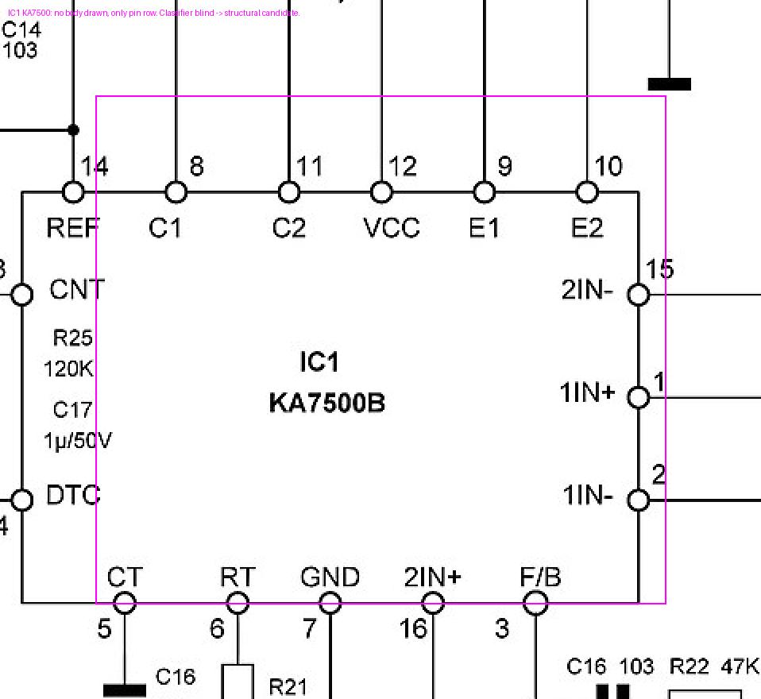

- On this sheet the IC has **no rectangle**, just terminal circles (`14`, `8`, `11`… top, `15`, `1`, `2` right) with labels like `REF`, `VCC`.
- The detector fires nothing here even at near-zero confidence. So instead of a detection, we carry a *candidate*: "something with 5+ legs in rows lives in this magenta box — build it in Stage 7."
- How rows are found: find small circles (radius 5–16 px) → drop ones inside known boxes → group circles sharing a straight line (5+ members, 150+ px span) → merge touching row+column groups. This run: exactly 1, the IC1 box.
- **Loops** (transistor cans, transformer frames = big closed outlines): this run found **0** — correct, the cans are already boxed and nothing else draws a closed outline. Zero is a verdict, not a failure.

### 7.2 Skeletons — peel wires to bones, count roads at each junction

Fat wires make messy crossings. Peel them (strip border pixels until 1 px bones remain) and every crossing becomes one center pixel where bones meet. Then count roads:

```
 3 roads (T)          4 roads, fat dot       4 roads, no dot
    |                    |  ●                  |
 ---●---  JOINED      ---●---  JOINED      ---●---  NOT joined
    |                    |                    |     (hop-over)
 (dot or not,          (dot present,         (bare X:
  always joins)         joins)                suspect)
```

The rule that decides everything: **a T always joins, dot or no dot. Only a bare 4-road X is suspicious.** cir1 is almost all dotless T's — that's why it works with 0 dots found.

Real SMPS sheet, 96 crossings sorted (this run):

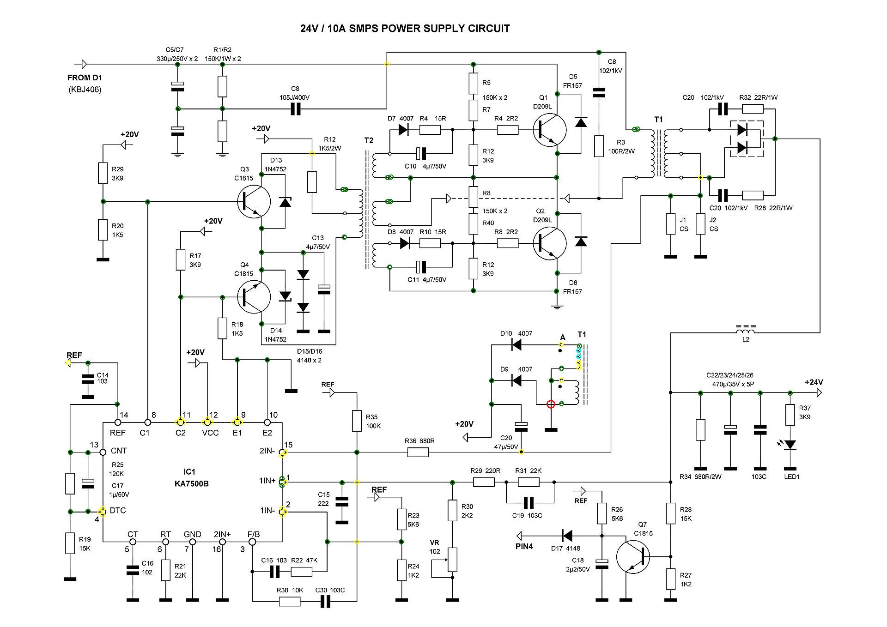

- **Green 64** = joined: fat black center or 3 roads or fewer. Done.
- **Yellow 29** = explained: sits on a coil loop, pin circle, can, or lead corner — part shape, not a wire hop. Done.
- **Cyan 2** = sits on a tiny text scrap touching wire. Done.
- **Red 1** = the only bare 4-road X with no dot and no part near it — at the transformer secondary, checked harmless twice. Stage 7's whole crossing list: one item, already cleared.

> Interview line: "The chip has no body, only pin circles, so circle rows become a build-it-later candidate. And every crossing gets its roads counted: T's always join, dotted X's join, only bare X's are suspects — 96 crossings down to 1 harmless."

---

## Lesson 8 — Validator (`constraints.py`)

> One-line job: check the wiring like an electrician. Every check ends PASS, FLAG, or MAP (solved-map) — never "maybe" — and every flag names its owner for Stage 7.

Real SMPS verdicts (167 parts this drift):

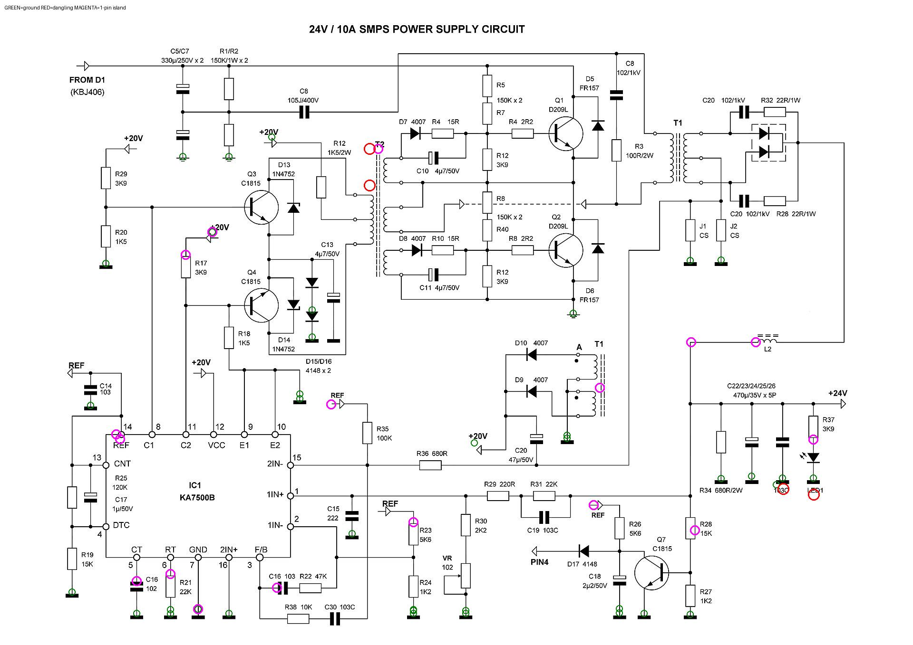

### The 8 checks, plainly

| # | Check | Plain meaning | This run |
|---|-------|---------------|----------|
| 1 | 2-leg parts | Every 2-leg part needs 2 *different* nets. Same net twice = shorted (same copper) or parallel-pack (shared live net, info only); missing leg = open | FLAG: 101 ok, 2 shorted, 2 open |
| 2 | transformer coils | Each coil pair on 2 nets (the simulator once caught a shorted coil that leg-counts alone passed) | FLAG: 2 ok, 4 flags |
| 3 | transistor legs | All legs present (c/b/e or d/g/s) and none floating | FLAG: 6 ok, 2 floating |
| 4 | live sources | Batteries/ports/rails must touch a shared net, not float alone | FLAG: 12 ok, 2 floating |
| 5 | ground join | All 27 ground scraps are one net — solved by building it, returns the map every later stage uses | MAP: 27 → GND, 37 legs, 0 floating |
| 6 | crossings | Lesson 7's list: 96 crossings, only bare X's suspect | FLAG with no work: 64 + 29 + 2 + 1 benign |
| 7 | lone/floating/shorts | 1-leg nets, legs with no net, rail touching ground — the Stage 7 worklist | 17 lone + 4 floating, 0 rail shorts |
| 8 | hop-over marks | Drawn hop-over boxes must not contain a dot; drawn junction marks must sit on one | PASS: 1 hop-over, 0 junctions |

Plus the IC1 footprint rides along for Stage 7 to build.

### How to read the picture

- **Green rings** = ground legs. 27 separate copper scraps, one net after check 5. Without that join, no divider-to-ground pattern in Lesson 9 could ever match.
- **Magenta rings** = lone-leg nets: a leg alone on dead copper (rescue noise, break scraps). Each is listed as `net: leg`.
- **Red rings** = floating: leg with no net at all — transformer legs, LED leg, spots the maze couldn't bridge cheaply. Left flagged correctly, not force-joined.

### Why FLAG is not failure

A FLAG is a priced ticket: what, where, whose. Stage 7 works exactly this list. Even empty classes report counts so the check proves it ran.

> Interview line: "Eight checks, every flag owned. Two opens, two floating transistors, seventeen loners and four floaters become Stage 7's exact worklist; twenty-seven grounds become one GND everything later uses."

---

## Lesson 9 — Motifs (`motifs.py`)

> One-line job: read the wiring like an engineer — find known circuit blocks, then use them to guess where a lost leg belongs.

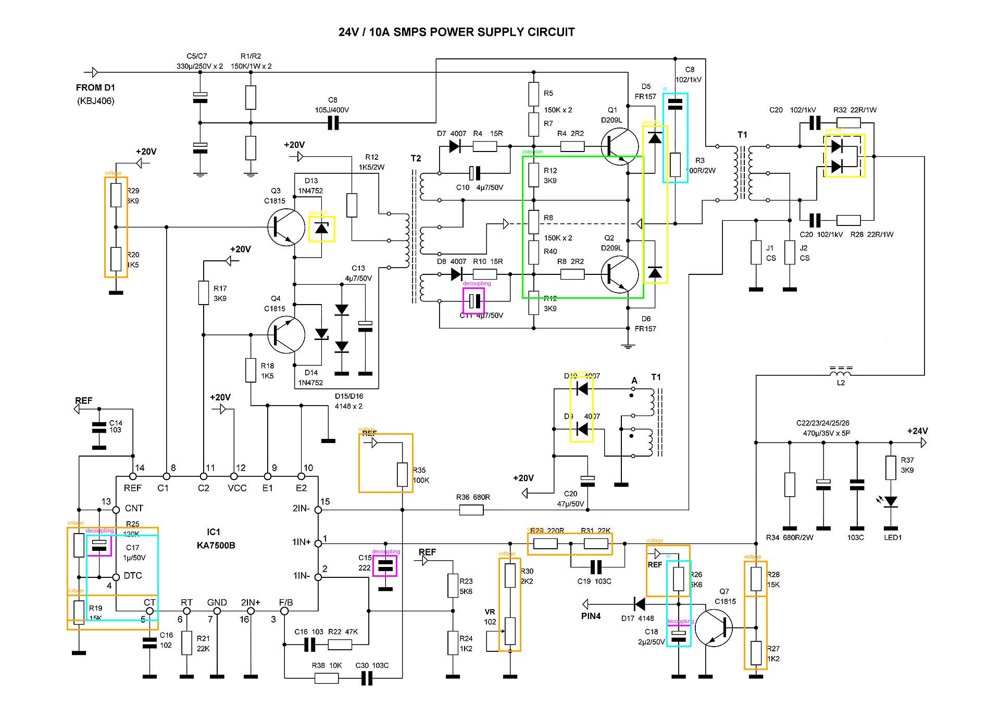

**Step 0 — join grounds first.** Everything below runs on nets *after* the Stage 5 ground join. Without it, nothing to ground can ever match.

**How a divider is found, concretely** (`find_dividers`): take the orange R29/R20 pair at top-left.
1. List R29's ends: `(top-rail, mid-point)`. List R20's ends: `(mid-point, GND)`.
2. Shared nets = exactly 1 (`mid-point`). The other two ends differ → 3 distinct nets. That's two resistors in a line with a tap.
3. Three guards: tap isn't GND (two pull-downs aren't a divider — this one rule killed 163 fakes); tap is small (5 legs or fewer — a rail hub with 20 legs isn't a tap); pair not seen before.
4. Note who else drinks from the tap: here it drives a transistor base — a real bias divider, checked on the photo. This run: 9 such pairs.

**The other blocks, same recipe style:**
- **Smoothing cap** (`find_decoupling`): capacitor with one end on GND, other on a busy rail (3+ legs). Magenta boxes. Count: 4.
- **Filter** (`find_rc`): resistor into a point + capacitor from that point to GND, point small (5 legs or fewer) so rail hubs don't fake filters. Cyan boxes. Count: 3. The flipped version: 0 — truly none on this sheet.
- **Amplifier stage** (`find_common_emitter`): transistor whose top leg reaches a busy net *through a resistor*, whose bottom leg reaches GND directly or through a resistor, whose middle leg is driven. Green box: Q2 + R8 + ground return. Count: 1. The flipped version: 0, correctly.
- **Diode pair** (`find_parallel_pair`): two diodes across the same two nets (the dashed dual packs, yellow). Which-way-round is deliberately *not* claimed — templates can't tell. Count: 4.

**How ranking works** (`rank_repairs`) — the bridge to Lesson 10. Take one lost leg, e.g. a floating transformer leg:
1. List every live net with copper within 120 px — distance to nearest net *copper dots*, not nearest leg (legs lie: on a long rail the true copper can be 15 px away while the nearest leg is 100+).
2. Score each: +2 if it's a divider tap found above, +2 if it's a busy rail (4+ legs) else +1 if live (3+), +2 more if we're a ground leg aiming at GND, minus distance/40.
3. Keep top 3. Zero candidates in range = delete signal (the port sitting on a dot gets none — Stage 7 removes it).

> Interview line: "First join grounds, then match shapes: dividers are two resistors over 3 nets with a small loaded tap, filters need a small middle point, amplifier stages need a pull-up to a busy net. Same shapes rank every lost leg's candidate nets by copper distance."

---

## Lesson 10 — Correction (`correct.py`)

> One-line job: work the validator's tickets in fixed order — junk first, grounds second, ranked joins third, build the missing chip fourth. Log everything; anything shaky stays flagged.

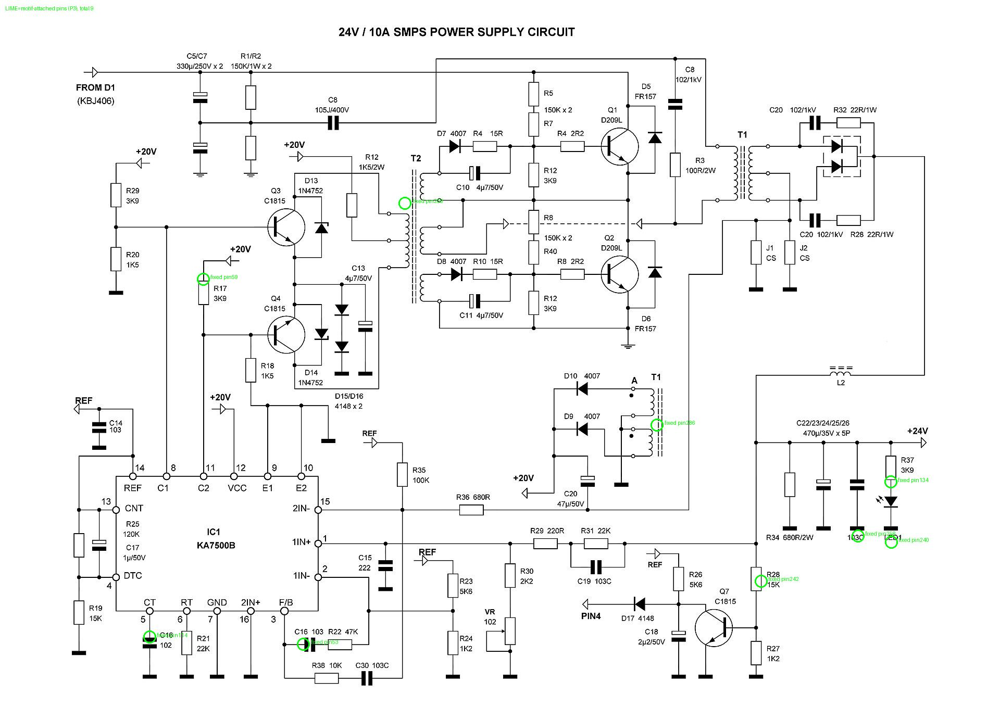

**P1 — throw out junk.** Rescued parts only. If *every* leg of the part is troubled *and* ranking gave zero candidates anywhere → hallucination (classic: a `port` box sitting on a junction dot). Delete part + legs. This run: nothing qualified.

**P2 — send grounds home.** Each troubled ground leg joins the nearest leg already on GND copper within 120 px. Island grounds are already GND by the map, so most need nothing. This run: no moves.

**P3 — join by rank, with two locks.** Each still-troubled leg takes its rank top pick *only if* all three hold (this run: 9 moved, 6 refused):
1. Score 1.0+ and distance 80 px or less — close *and* wanted (tap or rail), not just close.
2. **Sibling lock:** none of the part's *other* legs already holds that net. Joining it would short the part through its own body — the simulator once caught exactly this on a transformer coil, hence the refused-join log entries.
3. One move per leg, then recompute.

**P4 — build the missing chip.** Take the Lesson 7 footprint box. Re-find small terminal circles inside it. Remove doubles on an 8 px grid, top row first. For each circle, ask *which copper overlaps the leg disc* (most dots inside small radius wins, nearest breaks ties) — overlap, not distance, because a fat ground rail passing 6 px away once stole four legs under pure distance. Fall back to maze search if no overlap. This run: 1 chip + 13 legs, 13/13 wired. Logged warning is photo truth: the top row shares one copper bar (the pin-row guide line), so several legs read one net — flagged for review, not hidden.

**P5 — split overmerges.** Stage 5 reported none → logged no-op, with the check name, so the log proves it ran.

Clean-up (no ghosts): dropped parts/legs removed, survivors renumbered, nets regrouped. Lift: 2-leg check FLAG→PASS, floating transistors 3→2, sources FLAG→PASS, 167→168 parts, 86→81 nets. The coil FLAG stays: a real pre-existing transformer short, left honestly.

> Interview line: "Junk out, grounds home, rank-gated joins with sibling refusal, chip built from circles by copper overlap. Nine joins, six refusals, thirteen chip legs — the rest stays flagged."

---

## Lesson 11 — Netlist and Simulation (`netlist.py` + `asc_gen.py`)

> One-line job: turn the fixed wiring into two files — a simulator deck and a viewable drawing — then let two outside tools audit them instead of trusting ourselves.

### 11.1 Simulator lines — one per part (`netlist.py:36-108`)

Name rule (`node`): no net → visible `FLT_<leg>` (a floater you can count, never silently dropped); ground → `0`; else `N<number>`.

`emit()` writes one line per part (values are placeholders — reading printed numbers is next-milestone OCR work; *wiring* is this milestone):

```
 resistor/cap : R0 N13 N31 1k / C... 1u
 coil         : L.. 10u Rser=10m   (Rser stops divide-by-zero, per LTspice's own advice)
 diode        : D.. DMOD
 transistor   : Q.. Nc Nb Ne       (skipped if legs aren't c/b/e)
 transformer  : La + Lb + K card   (two coils + coupling line)
 switch       : S.. SMOD           (no ON/OFF word — the grammar checker crashes on it)
 fuse/lamp..  : as R 1k            (marked as-load, stated)
 chip         : X.. <legs in order> ICSTUB  (+ small ICSTUB block at file end)
 ground/text/gates/... : skipped, label-only (no copper of their own)
```

Proof sheet is cir1, small enough to hand-check (`demo/outputs/cir1/cir1_req.cir`):

```spice
* CircuitVision cir1 (topology + assigned values)
R0 N13 N31 6  ; resistor     <- printed sheet values filled in by hand
...
ITEST N10 N30 DC 1           <- push 1 amp from A to B
VREF N30 0 DC 0              <- B as zero reference
.op
```

Simulator reads **Req = 10.000000 Ω** — digit-for-digit with hand math. This SMPS run: 123 elements, 54 nodes, 0 bad lines, 1 floater.

### 11.2 The deck checker (`verify_spice`, `netlist.py:117-156`)

Second pass over the finished text, one pattern per first letter (R/C/L/K/D/Q/M/V/I/S/X): counts parts, skips `*` comments, counts connections per net, lists bad lines and loner nets (under 2 links, except ground). `build_netlist` (`netlist.py:159-177`) wraps: header + lines + models + chip block + `.op/.end`, returns text + report.

### 11.3 Drawing pieces (`placements`, `asc_gen.py:29-124`)

One function maps each fixed part to a library symbol with measured sizes (checked against LTspice's own symbol files; sideways = counter-clockwise, proven from a reference file):

- Resistor/coil/switch → sideways if legs are left-right, upright if top-bottom. Names match the deck exactly (`R0`, `S86`…).
- Capacitor/diode → same flat/tall split, shorter spans.
- Transistor → anchored on the base leg, top/middle/bottom spots fixed.
- Transformer (all 4 legs) → twin coils side by side + coupling note as text.
- Battery/source → vertical stick. Chip → plain rectangle + leg list. Anything else → noted "no symbol", label-only.

**One-to-one joining** (the R3.2 bug): each symbol contact greedily takes its nearest *unused* our-leg. The old version let two contacts share one leg and stranded the other as `NC_01` — the checker below caught it. Wire bits are right-angle only, no diagonals; zero-length bits skipped (they freeze LTspice — everything integer).

### 11.4 Straight rails, spread-out sheet (`_snap_coords`, `route_trees`, `gen_asc`)

- **Straighten** (tolerance 10): nudge near-equal leg x/y *within the same net* to their middle — detected dots jitter ±5 px, unstraightened trees zigzag every segment. Different nets can never share a value, so straightening can't short.
- **Spread 1.6×** about the center: detected boxes sit tighter than library symbols, so everything moves outward — relative layout kept, breathing room grows, net names untouched.
- **Wire trees:** shortest right-angle tree per net over leg dots. May cross unrelated copper — hence the must-pass re-check next.
- **Write-out:** symbols, rectangles, wires, and — the key trick — **one name label per leg** with our net names (ground → `0`). Labels, not drawn copper, carry the truth, so routing can never fake a short. Also returns the answer key: `(part, contact) → net` for the checker.

### 11.5 The checker that uses LTspice itself (`verify_asc`, `asc_gen.py:323-358`)

1. Run LTspice's own listing tool on the drawing → read its `.net` output.
2. Map `(part, contact slot)` → net (leg-name → slot table: p0→1, p1→2, c→1, b→2, e→3 …).
3. Compare with our answer key: count checked, list mismatches.
4. cir1: **20/20**. `pipeline.py:170-179` safety net: on any mismatch, redraw un-straightened and re-check — looks are cosmetic, correctness wins.

Three bugs this loop caught (each re-verified 20/20): wrong net-name prefix, decimal/zero-length wires freezing the tool, title text overlapping copper (moved below the drawing).

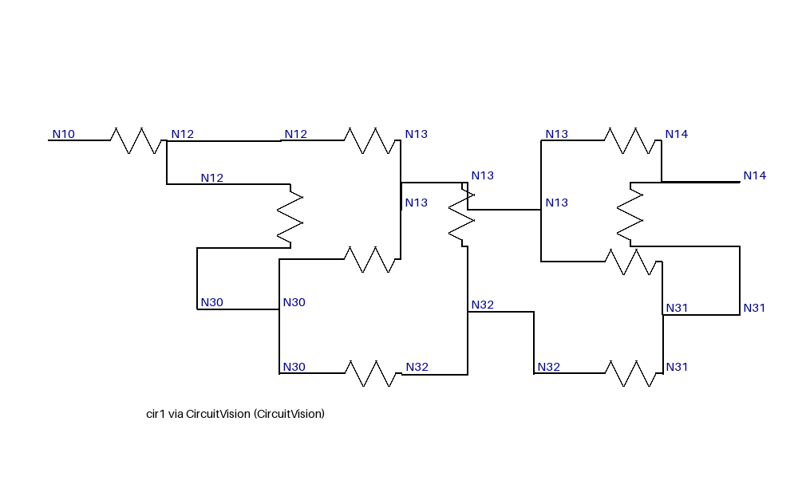

### 11.6 Preview picture + test signal (`asc_render.py`, `pipeline.py:199-234`)

- Preview draws the drawing with LTspice's own symbol art (same shapes the viewer shows). Picture above is that render.
- Test signal: 12 V battery model on the most-loaded resistor/top-leg rail (never a transistor middle leg or capacitor — largest-net once picked a base: wrong), tiny kicks on transistor tops, short transient run, batch-simulated → `.log/.raw`. SMPS solved in 0.068 s with only known-loner warnings. A second grammar tool re-reads every deck; two of its quirks are documented in code (switch suffix dropped, file forced to plain line endings). KiCad export waits on missing symbol libraries — deferred openly, its checks already covered by Stage 5.

> Interview line: "Placeholders for values, exact for wiring: matching names in deck and drawing, right-angle stubs plus one label per leg so labels carry truth, LTspice's own listing confirming 20/20 — and Req = 10.000000 Ω on cir1."

> Interview line: "Placeholders for values, exact for wiring: matching names in deck and drawing, right-angle stubs plus one label per leg so labels carry truth, LTspice's own listing confirming 20/20 — and Req = 10.000000 Ω on cir1."

---

## Interview Bank — simple answers (memorize these)

### 1. Tell me about your project (30 seconds)

> "I built CircuitVision — you give it a photo of a circuit schematic, it finds all the parts, figures out the wiring, and gives you a simulation-ready file plus a number that proves it's right. On a 10-resistor sheet it computes equivalent resistance as exactly 10 ohms, matching hand calculation."

### 2. Motivation — why build this?

- Drawing circuits in simulation software by hand is slow and boring. Photos of schematics (textbooks, whiteboards, old PDFs) can't be simulated directly.
- Existing AI tools are good at *finding* parts but bad at *wiring* — they guess connections and get the circuit wrong.
- So the real problem isn't detection, it's **topology**: which leg connects to which wire. That's what this project solves — with checks at every step instead of blind guessing.

### 3. What does it do, simply?

1. Finds parts in the photo (AI detector).
2. Marks each part's connection points (legs).
3. Traces the copper wires to group legs into nets.
4. Runs 8 sanity checks (like: "a resistor must touch 2 different wires").
5. Fixes what's fixable, flags the rest honestly.
6. Writes a simulator file + a drawing LTspice can open and run.

### 4. What did *you* do? (honest, simple)

- Built the full pipeline end to end and debugged every stage against real sheets.
- Trained and froze the detector vocabulary (106 messy classes → 68 clean ones).
- Wrote the leg/wire/graph logic, the 8 checks, and the repair passes.
- Verified with real numbers: detector scores, leg accuracy, before/after fix counts, and simulator matches.

### 5. Hardest problems + fixes (pick 2 to tell)

- **"Tall parts got sideways legs."** The template turned twice (shape guess + turn). Fix: one template, turn once. 40 parts fixed.
- **"The fixer was shorting parts."** Joining a floating leg to its own part's other leg fakes a short — 25 fake shorts. Fix: never join a sibling's net (checked in two places).
- **"Thin wires vanished."** One fixed black/white cutoff erased thin schematic wires. Fix: auto cutoff per photo — 2 broken connections healed.

### 6. Simple tech answers

- **Detector?** Looks at the image once, outputs boxes + labels + sureness. Ours finds resistors, capacitors, transistors, etc.
- **IoU?** Overlap ÷ total of two boxes. 0 = apart, 1 = same. Above 0.5 = same part twice → keep the surer one.
- **Net?** All copper at the same voltage. Touch a meter anywhere on it — same reading.
- **Auto cutoff?** Per-photo brightness split instead of one fixed number for all photos.
- **Tilted parts?** Left/right logic breaks at 45°, so find which way the ink blob stretches and put legs where that line exits the box.
- **Gap rescue?** A floating leg walks to the nearest wire; walking on wire is cheap, jumping blank paper is costly — only small gaps get bridged.
- **SPICE?** Text file describing parts + connections that a simulator can solve.
- **Accuracy (mAP)?** Share of predicted boxes overlapping truth enough. Ours ~0.67 at half-overlap.
- **Precision / recall?** Of my guesses, how many right (0.69) / of the truth, how much found (0.69).
- **Why freeze classes?** Can't learn a part from 12 photos — dropped rare names so the model learns the rest properly.

### 7. What's next / limits (say before asked)

- No reading of printed values yet (resistor numbers) — that's next; wiring first, values second.
- Big chips and coils are the detector's blind spot; worked around structurally, real fix is more training data.
- No batch benchmark against other tools yet.

### 8. Only 5 numbers to remember

| Sheet | Number |
|-------|--------|
| cir1 | 10/10 parts, answer = 10.000000 Ω exactly |
| SMPS | 113 found + 58 rescued = 171 parts, simulation solves |
| Detector | 68 classes, accuracy ~0.67 |
| Fixing | broken connections 2→0, stray legs 5→2 |
| Proof | LTspice agrees 20/20 connections |

---

## Interview Cheat Sheet

* **Rule:** part → leg → net, never part → part — every failure gets an address.
* **Overlap:** shared ÷ total. 0 apart, 1 same. 0.5 = same part twice, keep surer.
* **Cleanup:** sort by sureness first so the right label survives.
* **Legs:** one ideal sticker per part type, turned to match, slid onto real ink.
* **Flat or tall:** side wires vs top/bottom wires win; ties go by shape; only clear wins count.
* **Tilted:** ink stretch direction → border exits become legs.
* **Big chip:** clumps of black crossing the border = legs.
* **Numbers:** cir1 10/10, answer 10.0; SMPS 113+58=171, solves.
* **Wires:** auto cutoff per photo (cir1 173); cover boxes or symbols fake-shorts; blobs join at dots, dotless crossings stay split; legs grab nearest copper in a small window, maze bridges small gaps only.
* **Nets cir1:** 42 paint scraps → 39 nets → 7 live ones, 20/20 legs, 0 floating.
* **Rescue SMPS:** 431 ends → 119 unexplained → 13 end-boxes + 8 blobs → zoom 39 + harvest 19 = 58 rescued.
* **Loops/skeleton:** 0 loops (correct), 1 chip footprint from pin-circle rows; 96 crossings → 64 joined + 29 part-shapes + 2 text + 1 harmless.
* **Checks:** 8 rules, all owned. 27 grounds → 1; 17 loners + 4 floaters = fix list; 0 rail shorts.
* **Blocks:** 9 dividers + 4 smoothing + 3 filters + 1 amplifier + 4 pairs; lost legs ranked by tap/rail + copper distance, zero = delete.
* **Fixes:** junk out → grounds home → ranked joins (9 moved, 6 refused as self-shorts) → chip built (13 legs) → assert no overmerges.
* **Files:** per-part lines, matching names in deck and drawing; one label per leg so labels carry truth; LTspice 20/20, answer 10.000000 Ω; second grammar tool double-checks.
* **Training:** 116k photos merged/cleaned, names frozen 106→68, crash-proof GPU segments with resume; 640 then 1024 sharp-eyes, no flips; 0.665 and flat — graph stages carry the win.

Next: `build_graph.py` + `pipeline.py` (how it all wires together in one call).
